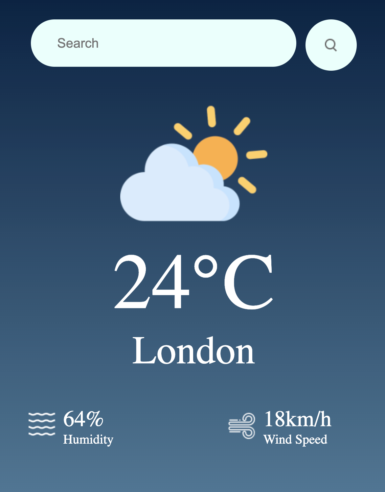

# WeatherApp

This is a simple weather app built using React.js and Vite. It utilizes the OpenWeather API to fetch weather data for different locations.

## Features

- Fetches current weather data for a specific location.
- Displays temperature, weather conditions, humidity, and wind speed.
- Provides a search functionality to find weather data for different locations.

## Technologies Used

- React.js
- Vite
- OpenWeather API

## Setup Instructions

1. Clone the repository.
2. Navigate to the project directory.
3. Install dependencies using `npm install`.
4. Get an API key from [OpenWeather](https://openweathermap.org/api) and replace `YOUR_API_KEY` in `src/utils/api.js` with your API key.
5. Run the app locally using `npm run dev`.
6. Open your browser and go to `http://localhost:3000` to view the app.

## Usage

- Enter the name of a city in the search bar and press Enter or click the search button.
- The app will display the current weather information for the provided city.

## Screenshots

  

## Credits

- This project was created by Megha Mittal.
- Weather data is provided by [OpenWeather API](https://openweathermap.org/api).
